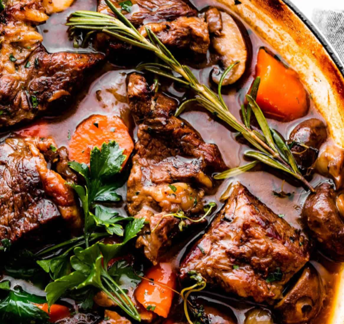

# Decadent dutch oven pot roast
> )
> Roast beef is a dish of beef which is roasted in an oven. Essentially prepared as a main meal, the leftovers can be and are often served within sandwiches and sometimes are used to make hash.

# List of things to have
- 2.5 lbs Beef Roast
- 1 Onion
- 2 cups Beef Broth
- 1 cup Red Wine
- 1/3 cup Flour
- 16 oz Tomatoes Diced
- 8 oz Tomatoes Sauce
- Carrots
- Mushroom
- Fresh or Dried Garlic
- Beef Rub (any beef seasoning)
- Worcestershire sauce

# Prepare the sauce
In a large mixing bowl pour in 1 cup beef broth and 1/3 cup flour. Wisk together, add another 1 cup of beef broth, wisk, add 1 cup red wine, wisk once more till smooth. Set to the side.

# Dutch oven cooking
Heat some oil on medium in a dutch oven. Finely dice up the 1 onion. Brown the onion and then remove from the dutch oven. Scrap the dutch oven and then add the beef roast and seer each site for around 4-5 minutes. Pull the beef roast from the dutch oven.

Add the browned onion back to the dutch oven (and some oil if needed) and mix together with the bits and peices left behind. Place beef roast on top, pour in the sauce you prepped, add 16 oz tomatoes diced and 8 oz tomatoe sauce, stir together. Add some fresh crushed garlic or powder and beef rub to desired seasoning. Top the roast with some worcestershire sauce as desired (don't be shy). Then add in carrots.

Cover and put in oven at 300 degree's for 4 hours. At the 4 hour mark remove dutch oven and add mushrooms. Continue to cook for 1 more hour. Pull from oven and enjoy with some mash potatoes.

# References
https://www.walmart.com/
https://www.ers.usda.gov/topics/animal-products/cattle-beef/
